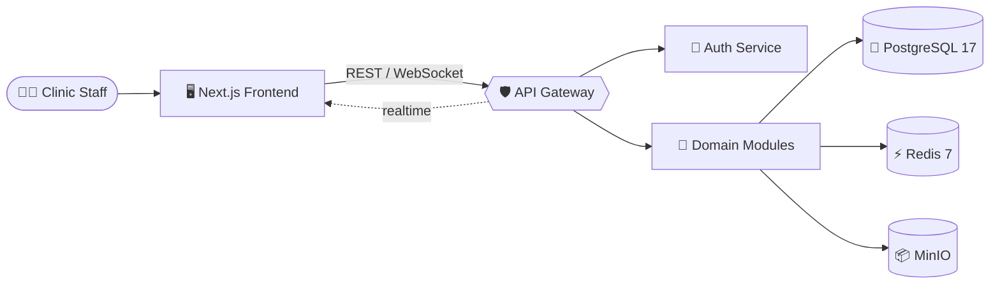

<div align="center">


<br />

# 🏥 MedCRM

### Enterprise-grade SaaS CRM / MIS platform for private clinics

### Профессиональная SaaS CRM / МИС-платформа для частных клиник

<br />

[](#)
[](#)
[](#-license--лицензия)
[](#)

<br />

[](#-english)
[](#-русский)

<br />


</div>

<br />

<div align="center">

> 🚀 **One modular SaaS foundation for everything a private clinic needs** — patient CRM, smart scheduling, live reception, EMR/EHR, finance, communications, inventory, integrations, analytics, RBAC, audit logging, and an API gateway.

</div>

<br />

---

<a id="-english"></a>

## 🇬🇧 English

MedCRM is a **production-oriented, multi-tenant clinic operating system**. It combines patient CRM, smart scheduling, live reception operations, EMR/EHR, finance, communications, inventory, integrations, analytics, RBAC, audit logging, and an API gateway into one modular SaaS foundation.

The project is intentionally built as a **modular monolith with service-ready boundaries**: fast enough for product iteration, strict enough for future extraction into independent services.

### 📚 Table of Contents

- [✨ Why MedCRM](#-why-medcrm)
- [🧩 Product Snapshot](#-product-snapshot)
- [🎬 Demo Workspace](#-demo-workspace)
- [🏗️ Architecture](#️-architecture)
- [🛠️ Tech Stack](#️-tech-stack)
- [⚡ Quick Start](#-quick-start)
- [🌐 Service Endpoints](#-service-endpoints)
- [🧪 Quality Gates](#-quality-gates)
- [🔌 API Examples](#-api-examples)
- [🗺️ Roadmap](#️-roadmap)

### ✨ Why MedCRM

<table>
<tr>
<td width="33%" valign="top">

#### 🏥 Built for Clinics
End-to-end workflows for front desk, doctors, finance, and warehouse — designed around real clinic operations, not generic CRM patterns.

</td>
<td width="33%" valign="top">

#### 🧱 Modular Monolith
Strict domain boundaries inside one runtime. Ready to extract any module into an independent service when scale demands it.

</td>
<td width="33%" valign="top">

#### 🔒 Multi-Tenant & Audit-Ready
Tenant-aware RBAC, audit logging, request correlation, and a hardened API gateway out of the box.

</td>
</tr>
<tr>
<td valign="top">

#### ⚡ Realtime Operations
Socket.IO-powered live queue, room load, and doctor load — the operations dashboard moves with the clinic.

</td>
<td valign="top">

#### 🧬 EMR / EHR with FHIR
Medical records, episodes, encounters, templates, diagnoses, prescriptions, and an FHIR preview for integration paths.

</td>
<td valign="top">

#### 📊 Production-Oriented
Modular Prisma schema, seeded demo data, OpenAPI aggregation, rate limiting, and E2E tests — built like a product, not a sample.

</td>
</tr>
</table>

### 🧩 Product Snapshot

| Area | What is implemented |
| --- | --- |
| 📋 **Operations** | Dashboard, live queue, room load, doctor load, operational KPIs |
| 👥 **Patient CRM** | Registry, duplicate search, tags, family model, notes, timeline, documents |
| 📅 **Scheduling** | Daily grid, week view, click-to-book, status transitions, waiting list |
| 🛎️ **Reception** | Check-in, queue priority, patient preview, invoices, cashier handoff |
| 🩺 **EMR / EHR** | Medical record, episodes, encounters, templates, diagnoses, prescriptions, FHIR preview |
| 💰 **Finance** | Invoices, payments, refunds, cashier shifts, wallets, billing, payroll rules |
| 💬 **Communications** | Telegram / SMS-ready conversations, templates, rules, campaigns, chatbot flows |
| 📦 **Inventory** | Warehouses, balances, batches, FEFO-oriented data, BOM, stock alerts |
| 🛡️ **Platform** | API gateway, public / internal routing, request tracing, RBAC, audit, realtime |
| 🧪 **QA** | E2E foundation for auth, patients, appointments, reception, scheduling conflicts |

### 🎬 Demo Workspace

Seeded demo data is designed to make the product presentable immediately after running migrations and seed:

| Demo entity | Included examples |
| --- | --- |
| 🏢 **Tenant** | `Demo Clinic`, enterprise plan, main branch |
| 👤 **Users** | Admin plus demo doctor accounts |
| 👨‍⚕️ **Doctors** | Radiology, dentistry, cardiology doctors with rooms and schedules |
| 🧑‍🤝‍🧑 **Patients** | VIP, family, child, new, active, and debt-bearing patient records |
| 📋 **Today board** | Confirmed, waiting, in-progress, pending-payment, completed, cancelled visits |
| 💳 **Finance** | Pending and paid invoices, cashier shift, payment gateway, subscription plan |
| 🩻 **EMR** | Medical record, active episode, draft encounter, diagnosis, prescription |
| 📨 **Communications** | SMS / Telegram templates, notification rule, chatbot confirmation flow |
| 🧰 **Inventory** | Main warehouse, room warehouse, batches, low stock, service BOM |

> 🔐 **Default credentials**

```text
tenantCode: demo-clinic
email:      admin@demo.clinic
password:   Admin123!
```

### 🏗️ Architecture

```text
MedCRM
├─ 🖥️  frontend/                Next.js 16 App Router, React 19
│   ├─ app/                     Protected routes and layouts
│   ├─ modules/                 Feature workspaces (auth, EMR, patient-crm, reception, scheduling)
│   └─ shared/                  API, permissions, realtime, UI primitives
│
├─ ⚙️  backend/                  NestJS modular backend
│   ├─ apps/
│   │  ├─ api-gateway/          Public / internal gateway and OpenAPI aggregation
│   │  └─ auth-service/         Domain modules hosted in service-ready boundaries
│   ├─ core/                    Audit, cache, DB, realtime, security, tenancy
│   └─ prisma/                  Schema, migrations, demo seed
│
└─ 🐳  docker-compose.yml        PostgreSQL, Redis, MinIO, gateway, backend, frontend
```

<div align="center">



</div>

### 🛠️ Tech Stack

| Layer | Stack |
| --- | --- |
| 🖥️ **Frontend** | Next.js 16, React 19, TypeScript, TailwindCSS, TanStack Query, Socket.IO Client, lucide-react |
| ⚙️ **Backend** | NestJS 11, TypeScript, Prisma ORM, Zod, JWT, Passport, Socket.IO, BullMQ |
| 🗄️ **Data** | PostgreSQL 17, Redis 7, MinIO |
| 🛡️ **Platform** | API Gateway, OpenAPI / Swagger, RBAC, audit logging, request correlation, rate limiting |
| 🧪 **Testing** | Node test runner, E2E suites, scheduling conflict tests |
| 🐳 **DevOps** | Docker Compose for local stack (Postgres, Redis, MinIO, gateway, backend, frontend) |

### ⚡ Quick Start

> ✅ **Requirements:** Node.js 24 LTS, npm, Docker (for Postgres / Redis / MinIO)

**1️⃣ Install dependencies & prepare env**

```bash
npm install
cp .env.example .env
```

**2️⃣ Boot the data layer**

```bash
docker compose up -d postgres redis minio
```

**3️⃣ Generate Prisma client, run migrations, seed demo data**

```bash
npm --workspace backend run prisma:generate
npm --workspace backend run prisma:migrate
npm --workspace backend run prisma:seed
```

**4️⃣ Launch services locally**

```bash
# Auth / domain service
npm --workspace backend run start:dev:auth

# API gateway
npm --workspace backend run start:dev:gateway

# Frontend (in a separate terminal)
NEXT_PUBLIC_API_URL=http://localhost:3000 \
INTERNAL_API_URL=http://localhost:3000 \
npm --workspace frontend run dev
```

### 🌐 Service Endpoints

| Service | URL |
| --- | --- |
| 🖥️ Frontend | <http://localhost:3002> |
| 🛡️ Public API Gateway | <http://localhost:3000> |
| 🔒 Internal API Gateway | <http://localhost:3010> |
| 🔐 Auth / domain service | <http://localhost:3001> |
| 📦 MinIO console | <http://localhost:9001> |

### 🧪 Quality Gates

```bash
# Frontend
npm --workspace frontend run typecheck
npm --workspace frontend run build

# Backend
npm --workspace backend run typecheck
npm --workspace backend run test:e2e
```

### 🔌 API Examples

> 🔐 **Login**

```bash
curl -X POST http://localhost:3000/auth/login \
  -H "Content-Type: application/json" \
  -d '{"tenantCode":"demo-clinic","email":"admin@demo.clinic","password":"Admin123!"}'
```

> 🚀 **Bootstrap session**

```bash
curl http://localhost:3000/auth/bootstrap \
  -H "Authorization: Bearer <access_token>"
```

> 🛎️ **Reception board**

```bash
curl http://localhost:3000/reception/dashboard \
  -H "Authorization: Bearer <access_token>"
```

### 🗺️ Roadmap

- 🔭 **Observability** — OpenTelemetry, Prometheus, Grafana, tracing, alerting.
- 🛡️ **Stronger tenant isolation** — centralized Prisma scopes, DB policies, tenant-aware jobs.
- ☁️ **Enterprise deployment** — Helm, Kubernetes, Terraform, backups, DR runbooks.
- 🎨 **Expanded frontend workspaces** — finance, inventory, communications, analytics.
- ✅ **Full QA platform** — unit, integration, contract, websocket, and e2e coverage.

---

<a id="-русский"></a>

## 🇷🇺 Русский

MedCRM — это **production-oriented SaaS-платформа для частных клиник**: CRM пациентов, умное расписание, живая регистратура, EMR / EHR, финансы, коммуникации, склад, интеграции, аналитика, RBAC, аудит и API Gateway в одной модульной системе.

Архитектурно проект построен как **модульный монолит с границами, готовыми к выделению сервисов**. Это дает скорость разработки MVP и при этом сохраняет путь к enterprise-эксплуатации.

### 📚 Содержание

- [✨ Почему MedCRM](#-почему-medcrm)
- [🧩 Что Реализовано](#-что-реализовано)
- [🎬 Демо-Данные](#-демо-данные)
- [🏗️ Архитектура](#️-архитектура)
- [🛠️ Стек](#️-стек)
- [⚡ Быстрый Старт](#-быстрый-старт)
- [🌐 Сервисы](#-сервисы)
- [🧪 Проверки](#-проверки)
- [🔌 Примеры API](#-примеры-api)
- [🗺️ Roadmap](#️-roadmap-1)

### ✨ Почему MedCRM

<table>
<tr>
<td width="33%" valign="top">

#### 🏥 Создано для Клиник
End-to-end процессы для регистратуры, врачей, финансов и склада — построено вокруг реальной работы клиники, а не универсальных CRM-шаблонов.

</td>
<td width="33%" valign="top">

#### 🧱 Модульный Монолит
Строгие границы доменов в одном runtime. Любой модуль готов к выделению в отдельный сервис, когда вырастет нагрузка.

</td>
<td width="33%" valign="top">

#### 🔒 Multi-Tenant и Audit-Ready
Тенант-аватарный RBAC, audit logging, request correlation и закаленный API Gateway — из коробки.

</td>
</tr>
<tr>
<td valign="top">

#### ⚡ Реальное Время
Живая очередь, загрузка кабинетов и врачей через Socket.IO — операционный дашборд движется вместе с клиникой.

</td>
<td valign="top">

#### 🧬 EMR / EHR с FHIR
Медкарты, эпизоды, приемы, шаблоны, диагнозы, назначения и FHIR preview для интеграций.

</td>
<td valign="top">

#### 📊 Production-Ready
Модульная Prisma-схема, seeded демо-данные, OpenAPI-агрегация, rate limiting и E2E-тесты.

</td>
</tr>
</table>

### 🧩 Что Реализовано

| Контур | Реализация |
| --- | --- |
| 📋 **Операции** | Операционная панель, живая очередь, загрузка кабинетов, загрузка врачей, KPI смены |
| 👥 **CRM пациентов** | Реестр, поиск дублей, теги, семья, заметки, timeline, юридические документы |
| 📅 **Расписание** | Дневная сетка, недельный вид, click-to-book, статусы, лист ожидания |
| 🛎️ **Регистратура** | Check-in, приоритет очереди, быстрый просмотр пациента, счета, передача в кассу |
| 🩺 **EMR / EHR** | Медкарта, эпизоды, приемы, шаблоны, диагнозы, назначения, FHIR preview |
| 💰 **Финансы** | Счета, оплаты, возвраты, кассовые смены, кошельки, billing, payroll rules |
| 💬 **Коммуникации** | Telegram / SMS-ready inbox, шаблоны, правила, кампании, chatbot flows |
| 📦 **Склад** | Склады, остатки, партии, FEFO-данные, BOM, stock alerts |
| 🛡️ **Платформа** | API Gateway, public / internal routing, request tracing, RBAC, audit, realtime |
| 🧪 **Тесты** | E2E для auth, patients, appointments, reception, scheduling conflicts |

### 🎬 Демо-Данные

Seed заполняет проект данными так, чтобы интерфейсы сразу выглядели как рабочая клиника:

| Что есть | Примеры |
| --- | --- |
| 🏢 **Клиника** | `Demo Clinic`, enterprise plan, основной филиал |
| 👤 **Пользователи** | Администратор и демо-врачи |
| 👨‍⚕️ **Врачи** | УЗИ / радиология, стоматология, кардиология, кабинеты и расписания |
| 🧑‍🤝‍🧑 **Пациенты** | VIP, семья, ребенок, новый пациент, активные пациенты, пациенты с долгом |
| 📋 **Today board** | Подтвержден, ожидает, на приеме, к оплате, завершен, отменен |
| 💳 **Финансы** | Pending / paid invoices, кассовая смена, payment gateway, subscription plan |
| 🩻 **EMR** | Медкарта, активный эпизод, черновик приема, диагноз, назначение |
| 📨 **Коммуникации** | SMS / Telegram шаблоны, notification rule, chatbot подтверждения |
| 🧰 **Склад** | Центральный склад, кабинетный склад, партии, низкий остаток, BOM услуги |

> 🔐 **Демо-доступ**

```text
Код клиники: demo-clinic
Email:       admin@demo.clinic
Пароль:      Admin123!
```

### 🏗️ Архитектура

```text
MedCRM
├─ 🖥️  frontend/                Next.js 16 App Router, React 19
│   ├─ app/                     Защищенные маршруты и layout
│   ├─ modules/                 Рабочие пространства модулей
│   └─ shared/                  API, permissions, realtime, UI primitives
│
├─ ⚙️  backend/                  NestJS modular backend
│   ├─ apps/
│   │  ├─ api-gateway/          Public / internal gateway и OpenAPI aggregation
│   │  └─ auth-service/         Доменные модули с сервисными границами
│   ├─ core/                    Audit, cache, DB, realtime, security, tenancy
│   └─ prisma/                  Schema, migrations, demo seed
│
└─ 🐳  docker-compose.yml        PostgreSQL, Redis, MinIO, gateway, backend, frontend
```

### 🛠️ Стек

| Слой | Технологии |
| --- | --- |
| 🖥️ **Frontend** | Next.js 16, React 19, TypeScript, TailwindCSS, TanStack Query, Socket.IO Client, lucide-react |
| ⚙️ **Backend** | NestJS 11, TypeScript, Prisma ORM, Zod, JWT, Passport, Socket.IO, BullMQ |
| 🗄️ **Data** | PostgreSQL 17, Redis 7, MinIO |
| 🛡️ **Platform** | API Gateway, OpenAPI / Swagger, RBAC, audit logging, request correlation, rate limiting |
| 🧪 **Testing** | Node test runner, E2E suites, scheduling conflict tests |
| 🐳 **DevOps** | Docker Compose для локального стека (Postgres, Redis, MinIO, gateway, backend, frontend) |

### ⚡ Быстрый Старт

> ✅ **Требования:** Node.js 24 LTS, npm, Docker (для Postgres / Redis / MinIO)

**1️⃣ Установить зависимости и подготовить env**

```bash
npm install
cp .env.example .env
```

**2️⃣ Поднять data layer**

```bash
docker compose up -d postgres redis minio
```

**3️⃣ Сгенерировать Prisma client, применить миграции и seed**

```bash
npm --workspace backend run prisma:generate
npm --workspace backend run prisma:migrate
npm --workspace backend run prisma:seed
```

**4️⃣ Запустить сервисы локально**

```bash
# Auth / domain сервис
npm --workspace backend run start:dev:auth

# API gateway
npm --workspace backend run start:dev:gateway

# Frontend (в отдельном терминале)
NEXT_PUBLIC_API_URL=http://localhost:3000 \
INTERNAL_API_URL=http://localhost:3000 \
npm --workspace frontend run dev
```

### 🌐 Сервисы

| Сервис | URL |
| --- | --- |
| 🖥️ Frontend | <http://localhost:3002> |
| 🛡️ Public API Gateway | <http://localhost:3000> |
| 🔒 Internal API Gateway | <http://localhost:3010> |
| 🔐 Auth / domain service | <http://localhost:3001> |
| 📦 MinIO console | <http://localhost:9001> |

### 🧪 Проверки

```bash
# Frontend
npm --workspace frontend run typecheck
npm --workspace frontend run build

# Backend
npm --workspace backend run typecheck
npm --workspace backend run test:e2e
```

### 🔌 Примеры API

> 🔐 **Логин**

```bash
curl -X POST http://localhost:3000/auth/login \
  -H "Content-Type: application/json" \
  -d '{"tenantCode":"demo-clinic","email":"admin@demo.clinic","password":"Admin123!"}'
```

> 🚀 **Bootstrap сессии**

```bash
curl http://localhost:3000/auth/bootstrap \
  -H "Authorization: Bearer <access_token>"
```

> 🛎️ **Доска регистратуры**

```bash
curl http://localhost:3000/reception/dashboard \
  -H "Authorization: Bearer <access_token>"
```

### 🗺️ Roadmap

- 🔭 **Observability** — OpenTelemetry, Prometheus, Grafana, tracing, alerting.
- 🛡️ **Tenant isolation** — централизованные Prisma scopes, DB policies, tenant-aware jobs.
- ☁️ **Enterprise deployment** — Helm, Kubernetes, Terraform, backups, DR runbooks.
- 🎨 **Расширение UI** — финансы, склад, коммуникации, аналитика.
- ✅ **Полная QA-платформа** — unit, integration, contract, websocket и e2e tests.

---

## 📁 Documentation / Документация

Detailed architecture and design briefs live in [`docs/`](./docs):

- 📐 [`docs/architecture/`](./docs/architecture) — modular monolith, tenancy, scheduling, RBAC, backend / frontend trees.
- 🎨 [`docs/design/`](./docs/design) — UI design briefs and implementation specs.
- 📊 [`docs/project-audit.html`](./docs/project-audit.html) — project audit report.

---

## 📄 License / Лицензия

Private project. All rights reserved unless a license is added by the repository owner.

Частный проект. Все права защищены, если иное не указано владельцем репозитория.

<div align="center">

<br />

**Made with 💚 for modern private clinics**

<sub>Built as a modular monolith • Ready for enterprise • Bilingual by design</sub>

</div>
